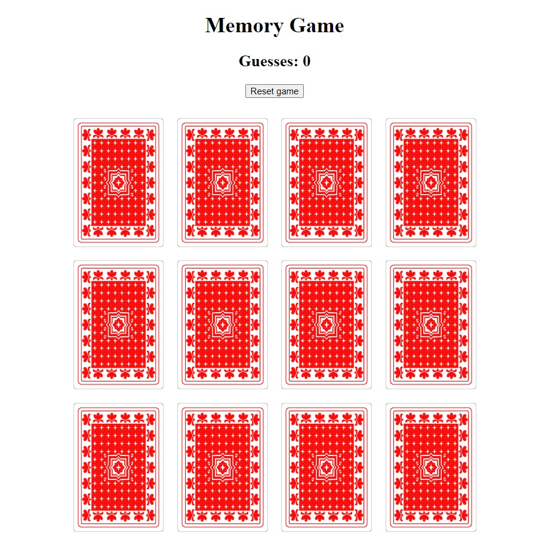

# Memory Card Game
JavaScript, HTML and CSS card game

This is a browser-based game that allows users to test their memory skills by matching pairs of cards. The game is written in JavaScript, CSS, and HTML.

The application uses a shuffled array of cards, to create a randomized game board. Users flip cards over by clicking on them, revealing the hidden image. The goal of the game is to match all of the pairs of cards in the least amount of clicks.

The game keeps track of the user's progress by displaying the number of clicks. It also includes a reset button that allows the user to start a new game at any time.

With its responsive design, the memory game seamlessly adapts to the screen size of any device, enabling easy play on both desktop and mobile.

This memory card game is a fun and engaging way to test your memory and improve your cognitive skills. It is a great tool for both children and adults, and can be played alone or with friends and family.

# Play the game online
https://lepiej.github.io/javascript-memory-card-game/

# Screenshot

